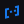

<pre>

Hello Coders!
</pre><pre>
<h2>About</h2>

I like to configure my operating system
and create accessible websites.

pronouns: [he/they](https://pronoundb.org/)
website: [bricked.dev](https://bricked.dev/)
codeberg: [@bricked](https://codeberg.org/bricked)
matrix: [@bricked:beeper.com](https://matrix.to/#/@bricked:beeper.com)
discord: [@brckd](https://discord.com/users/691572882148425809)
</pre><pre><h2>Projects</h2>

These are some things I like to work on
or support.

[nixdots](https://github.com/brckd/NixDots): my dotfiles for NixOS
[bricked.dev](https://bricked.dev):  my very own website
[bricked.dev/blog](https://bricked.dev/blog): my personal blog
[maxy.top](https://maxy.top): a friend's website, which I
am proudly sponsoring
</pre><pre><h2>Stats</h2>

This is how I've contributed to open-
source projects.

<picture height="160em" alt="GitHub Stats">
<source 
  srcset="https://github-readme-stats.vercel.app/api?username=brckd&hide_rank=true&count_private=true&custom_title=GitHub%20Stats&hide=issues&show_icons=true&hide_border=true&bg_color=0000&theme=github_dark"
  media="(prefers-color-scheme: dark)"
/>

</picture>
<picture height="160em" alt="Most Used Languages">
<source 
  srcset="https://github-readme-stats.vercel.app/api/top-langs?username=brckd&layout=compact&hide_border=true&bg_color=0000&theme=github_dark"
  media="(prefers-color-scheme: dark)"
/>

</picture></pre>
