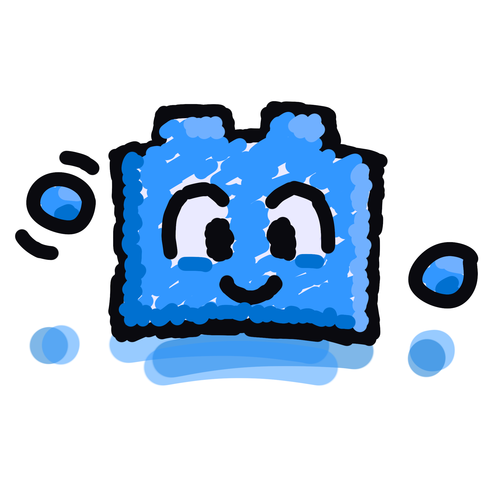

# I am bricked

Hay, I'm <strong>bricked</strong> and I love using and contributing to
open-source software. So far I have specialized in NixOS configurations,
accessible websites and Discord bots, but I always love to learn something new!

|          |                                                    |
| -------- | -------------------------------------------------- |
| pronouns | [he/they](https://pronoundb.org/)                  |
| website  | [bricked.dev](https://bricked.dev/)                |
| socials  | [bricked.dev/socials](https://bricked.dev/socials) |

## Projects

These are some things I like to work on or support.

|                                        |                                                                         |
| -------------------------------------- | ----------------------------------------------------------------------- |
| [nixdots](https://nixdots.bricked.dev) | my dotfiles for [NixOS](https://nixos.org)                              |
| [bricked.dev](https://bricked.dev)     | my personal website & blog                                              |
| [cade.party](https://cade.party)       | microservices for the [Fancade](https://fancade.com) mobile game engine |
| [maxy.top](https://maxy.top)           | a friend's website, which I am proudly sponsoring                       |

## Stats

This is how I've contributed to open- source projects.

<picture height="160em" alt="GitHub stats">
<source 
  srcset="https://github-readme-stats.vercel.app/api?username=brckd&hide_rank=true&custom_title=GitHub%20Stats&hide=issues&show_icons=true&hide_border=true&bg_color=0000&theme=github_dark"
  media="(prefers-color-scheme: dark)"
/>

</picture>
